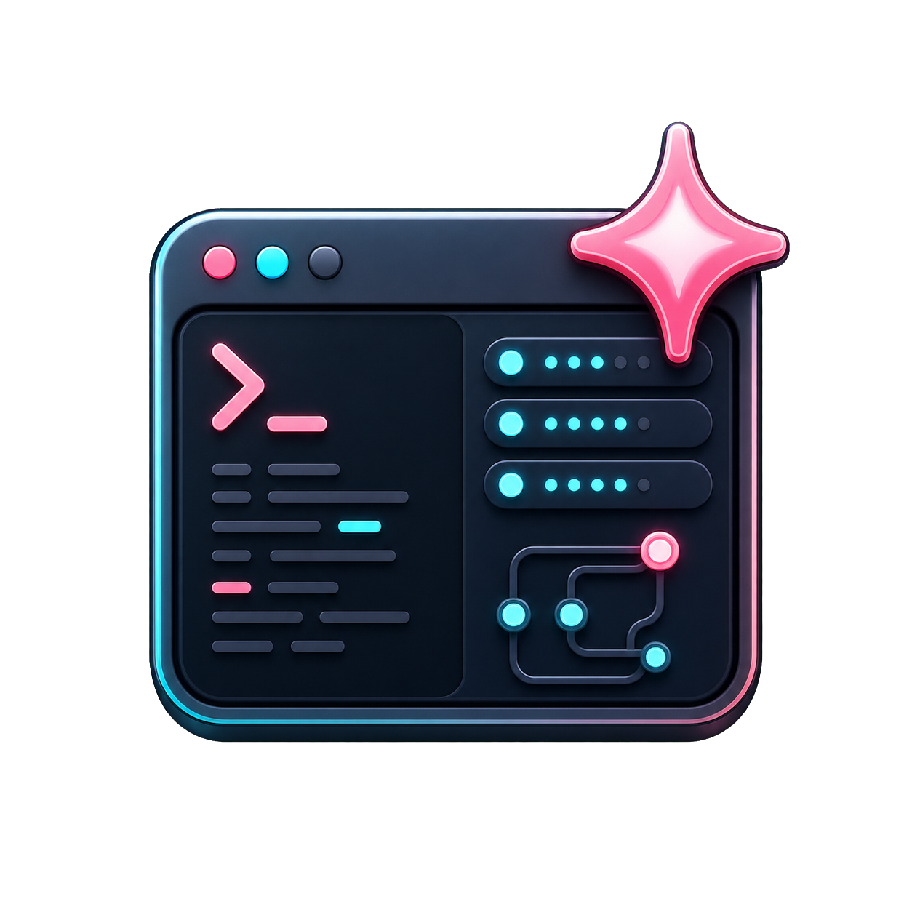

<div align="center">



# 🌸 Saki Panel

**首个深度融合 AI Agent 的服务器运维面板 · 用自然语言管服务器**

[](LICENSE)
[](https://www.typescriptlang.org/)
[](https://react.dev/)
[](https://fastify.dev/)
[](https://nodejs.org/)

> “帮我重启一下那个 Node 服务”  
> “磁盘又他妈快满了，帮我看看哪些日志能删”  
> “MC 服务器升个最新版，别给爷整崩了”

**—— 说人话，Saki 帮你干。**

[🤖 Saki Agent](#-saki-agent--不是聊天机器人是真干活的) · [🚀 快速开始](#-快速开始3-分钟上手) · [🏗️ 架构](#️-架构) · [✨ 功能](#-功能一览硬核到飞起) · [🐳 部署](#-部署) · [⚖️ 许可](#️-许可)

</div>

---

## 为什么又要造一个运维面板？

市面上面板不要太多：**宝塔**、**1Panel**、**Pterodactyl**、**MCSManager**……都挺好用。

但它们有一个致命共同点：

> **你让它干啥，它才干啥。点按钮、敲命令、你当工具人，它当执行机。真的是唐完了，兄弟。**

Saki Panel 不一样。

Bro 不是"传统面板 + 一个聊天框"的低能缝合怪，而是**从架构底层就把 AI Agent 深度融合**进整个运维工作流：

- **真·上下文感知**：自动读取实例状态、实时日志、文件列表、系统指标，不用你再复制粘贴一堆屎山
- **真·会动手**：能直接启停服务、读写文件、执行命令，不是只会嘴炮的 AI 嘴替
- **审批机制护体**：高危操作（比如 `rm -rf` 级别的）必须你点头，否则直接拦截，永别了手滑删库跑路
- **技能系统**：把常用运维套路封装成 Skill，一键套娃，团队共享
- **MCP 协议支持**：想接外部工具就接，理论上能力能膨胀到无上限

**别的面板是工具，Saki Panel 是你 24 小时在线的运维同事。**

终于不用再半夜三点被"服务器又挂了"微信轰炸了，兄弟们，赛博 AI 牛马时代来了！

What can I say, man, it's Saki Panel. 🗿

---

## 🤖 Saki Agent — 不是聊天机器人，是真·干活的

```text
普通面板的 AI： 你问 → 它答 → 你去手动操作 → 它在旁边优雅看戏 → 🤡
Saki Agent：    你说 → 它思考 → 它直接干 → 高危操作找你确认 → 完事收工 → 😎
```

| 核心能力 | 说明 |
|:---------|:-----|
| 🧠 **上下文感知** | 自动拉取实例状态、实时日志、文件结构、CPU/内存/磁盘数据，不用你当复读机 |
| 🎬 **操作执行** | 直接启停重启实例、读写文件、跑终端命令——是真的会动手，不是 PPT 级 Agent |
| 🛡️ **风险审批** | 4 级风险分级（low / medium / high / critical），high 以上必须人工 approve，critical 直接干掉 |
| 🎯 **技能系统** | 常用运维骚操作封装成 Skill（prompt 模板），一键复用，团队共享 |
| 📎 **多模态输入** | 甩张报错截图、丢个日志文件，Saki 都能看懂 |
| 🔌 **MCP 支持** | Model Context Protocol，接外部工具，能力直接起飞 |
| 🎭 **Live2D 交互** | 调酒、跳舞、戳一戳、打招呼，打工之余还能调戏一下（bushi） |

### 配置超级简单（本地零成本）

```env
SAKI_PROVIDER=ollama
SAKI_MODEL=llama3.2
SAKI_OLLAMA_URL=http://localhost:11434
```

本地 [Ollama](https://ollama.com/) 一键跑，**完全免费**。也支持 OpenAI、DeepSeek、通义千问、Gemini 等所有兼容接口，**不锁模**，想用啥模型用啥模型。本地跑不动了？直接接个 API Key 就行，灵活到飞起。

---

## ✨ 功能一览（硬核到飞起）

<table>
<tr>
<td width="50%">

### 🤖 Saki Agent
上下文感知 · 真实操作执行 · 风险审批 · 技能系统 · MCP 扩展 · 多模态 · Live2D

</td>
<td width="50%">

### 📊 仪表盘
节点在线状态 · 实时 CPU/内存/磁盘曲线 · 最近操作 & 登录记录

</td>
</tr>
<tr>
<td width="50%">

### ⚙️ 实例管理
9 种实例类型 · 启停重启强杀 · 实时日志 · 崩溃自动重启 · **Agent 可直接操控**

</td>
<td width="50%">

### 💻 网页终端
xterm.js + WebSocket · 断线重连 · **Agent 能帮你敲命令**

</td>
</tr>
<tr>
<td width="50%">

### 📁 文件管理
目录浏览 · CodeMirror 在线编辑 · 上传下载 · 智能解压（zip/rar/7z）· **Agent 可读写文件**

</td>
<td width="50%">

### ⏰ 计划任务
Cron 定时 · 手动触发 · 运行历史 · 实例自启动 + 崩溃重启策略

</td>
</tr>
<tr>
<td width="50%">

### 🖥️ 节点管理
Daemon 自动注册 · 心跳保活 · 连通性测试 · 系统指标采集

</td>
<td width="50%">

### 🔒 安全与权限
RBAC（42 个权限码）· 审计日志 · 登录限流 · 危险命令拦截

</td>
</tr>
</table>

---

## 🏗️ 架构

```
┌──────────────┐       HTTP/WS        ┌──────────────┐       HTTP/WS        ┌──────────────┐
│              │  ◄─────────────────►  │              │  ◄─────────────────►  │              │
│   🌐 Web     │       JWT            │   📋 Panel   │     Node Token       │   🔧 Daemon  │
│   React SPA  │                      │   Fastify    │                      │   Fastify    │
│   + Saki UI  │                      │   + Saki AI  │                      │              │
│   :5478      │                      │   + SQLite   │                      │   :24444     │
│              │                      │   :5479      │                      │              │
└──────────────┘                      └──────────────┘                      └──────┬───────┘
                                                                                   │ spawn
                                                                                   ▼
                                                                            ┌──────────────┐
                                                                            │   📦 实例进程  │
                                                                            └──────────────┘
```

| 组件 | 职责 | 技术栈 |
|:-----|:-----|:-------|
| **Web** | 前端管理界面 + Saki 交互 UI | React 19 · Vite 6 · CodeMirror 6 · xterm.js 6 · Recharts |
| **Panel** | 中央控制 + Saki Agent 引擎 | Fastify 5 · Prisma 6 · SQLite · JWT · LLM API |
| **Daemon** | 节点代理，执行实际操作 | Fastify 5 · systeminformation · 7zip-bin |
| **Shared** | 前后端共享类型 | 纯 TypeScript，零依赖 |

> 💡 **一句话理解：** Panel 是大脑（Saki 住在这里），Daemon 是手脚，Web 是脸，Shared 是共同语言。

---

## 🗂️ 项目结构

```
Saki Panel/
├── apps/
│   ├── web/                  # 前端 SPA（React 19 + Vite 6）
│   ├── panel/                # 后端控制面板 + Saki Agent 引擎
│   └── daemon/               # 节点守护进程
├── packages/
│   └── shared/               # 前后端共享类型定义
├── prisma/
│   └── schema.prisma         # 数据库模型（9 张表）
├── scripts/
│   ├── windows/              # Windows 一键启动（PowerShell）
│   ├── linux/                # Linux 启动 + systemd 服务
│   └── macos/                # macOS 一键启动（双击即跑）
├── docker-compose.yml
└── .env.example
```

---

## 🚀 快速开始（3 分钟上手）

### 前置要求

- Node.js >= 18
- npm >= 9
- （强烈推荐）[Ollama](https://ollama.com/) 用于本地运行 Saki Agent

### 本地开发

```bash
# 1. 克隆 + 安装依赖
git clone https://github.com/EthanChan050430/Saki-Panel.git && cd Saki-Panel
npm install

# 2. 初始化数据库
npx prisma db push --skip-generate

# 3. 一键启动开发模式
npm run dev
```

### 一键启动脚本（自动避让端口）

| 平台 | 命令 | 说明 |
|:-----|:-----|:-----|
| 🪟 Windows | 双击 `scripts/windows/start-dev.ps1` | PowerShell 自动避让端口 |
| 🐧 Linux | `bash scripts/linux/start-dev.sh` | 同样智能避让 |
| 🍎 macOS | 双击 `scripts/macos/start-dev.command` | 双击即跑，爽 |

### 默认访问

| 服务 | 地址 |
|:-----|:-----|
| Web 界面 | http://localhost:5478 |
| Panel API | http://localhost:5479 |
| Daemon | http://localhost:24444 |

### 默认管理员

| 字段 | 值 |
|:-----|:---|
| 用户名 | `admin` |
| 密码 | `admin123456` |

> ⚠️ **生产环境务必修改** `JWT_SECRET`、`ADMIN_PASSWORD`、`DAEMON_REGISTRATION_TOKEN`。别问为什么，问就是安全。

---

## 🎯 实例类型支持

| 类型 | 说明 |
|:-----|:-----|
| `generic_command` | 通用命令行 |
| `nodejs` | Node.js 应用 |
| `python` | Python 脚本 |
| `java_jar` | Java JAR 包 |
| `shell_script` | Shell 脚本 |
| `docker_container` | Docker 容器 |
| `docker_compose` | Docker Compose 编排 |
| `minecraft` | Minecraft 服务器 |
| `steam_game_server` | Steam 游戏服务器 |

---

## 🔐 安全

| 机制 | 细节 |
|:-----|:-----|
| 鉴权 | JWT Token + bcrypt 密码哈希 |
| 权限 | RBAC，42 个权限码，3 个内置角色 |
| 限流 | 登录失败 5 次/10 分钟锁定 |
| 命令拦截 | 4 级风险分级（low → critical），critical 直接拦截 |
| Agent 审批 | high 风险操作需人工 approve，支持 reject 和 rollback |
| 审计 | 全操作日志记录（用户/IP/动作/结果） |
| 路径隔离 | 文件操作限制在 workspace 内，防路径逃逸 |
| 解压防护 | 条目数 ≤ 5000，解压大小 ≤ 512MB |

---

## 🛠️ 技术栈

| 层 | 技术 |
|:---|:-----|
| 语言 | TypeScript（全栈，没有 JS 的位置） |
| Monorepo | npm workspaces |
| 前端 | React 19 · Vite 6 · CodeMirror 6 · xterm.js 6 · Recharts · Lucide |
| 后端 | Fastify 5 · Prisma 6 · SQLite |
| AI Agent | LLM API（Ollama / OpenAI 兼容）· MCP · Skill System · Approval Flow |
| 终端 | xterm.js + WebSocket 代理 |
| 部署 | Docker Compose · systemd |

---

## 📋 开发命令

```bash
npm run dev          # 启动全部服务（panel + daemon + web）
npm run dev:panel    # 仅启动 Panel
npm run dev:daemon   # 仅启动 Daemon
npm run dev:web      # 仅启动 Web
npm run build        # 构建全部
npm run check        # 类型检查全部
npm run db:push      # 同步数据库 schema
```

---

## 🐳 部署

### Docker Compose（推荐生产环境）

```bash
# 构建并启动
docker compose build
docker compose up -d
```

生产环境需要设置环境变量：

```bash
export JWT_SECRET="your-secret-here"
export ADMIN_PASSWORD="your-password-here"
export DAEMON_REGISTRATION_TOKEN="your-token-here"

docker compose up -d
```

### systemd（Linux）

```bash
sudo cp scripts/linux/saki-panel.service /etc/systemd/system/
sudo cp scripts/linux/saki-panel-daemon.service /etc/systemd/system/
sudo systemctl enable --now saki-panel
sudo systemctl enable --now saki-panel-daemon
```

---

## 🔍 为什么 Saki Panel 更香？（SEO 关键词轰炸区）

**AI 服务器运维面板** · **AI Agent 运维** · **智能运维平台** · **Ollama 运维面板** · **LLM 服务器管理**

**MCP 运维工具** · **自然语言服务器管理** · **AI 自动化运维** · **服务器面板** · **运维自动化**

告别传统面板手动运维，**智能运维** 时代来了！本地 Ollama 部署零 API 费用，高危命令拦截防删库跑路，技能系统 + MCP 能力无限扩展，多模态输入甩图问问题也能懂。

不管你是搜 **宝塔替代**、**1Panel 替代**、**Pterodactyl 替代**、**MCSManager 替代**，还是搜 **AI 运维面板**、**AI Agent 服务器管理**、**Ollama 面板**，Saki Panel 都是你最好的选择。

Bro 都是这么牛逼的字母哥了，你还奢求啥传统面板？赶紧上车 Saki Panel，和 AI Agent 一起开黑运维！🚀

---

## ⚖️ 许可

```
Copyright 2024-2026 DreamStarryRobot Contributors

Licensed under the Apache License, Version 2.0 (the "License");
you may not use this file except in compliance with the License.
You may obtain a copy of the License at

    http://www.apache.org/licenses/LICENSE-2.0

Unless required by applicable law or agreed to in writing, software
distributed under the License is distributed on an "AS IS" BASIS,
WITHOUT WARRANTIES OR CONDITIONS OF ANY KIND, either express or implied.
See the License for the specific language governing permissions and
limitations under the License.
```

---

<div align="center">

卧槽这破玩意浪费了我整整12个小时高强度vibe coding，不点个Star良心不会痛的，兄弟们！🙏

</div>
