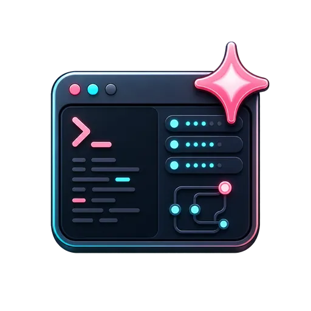
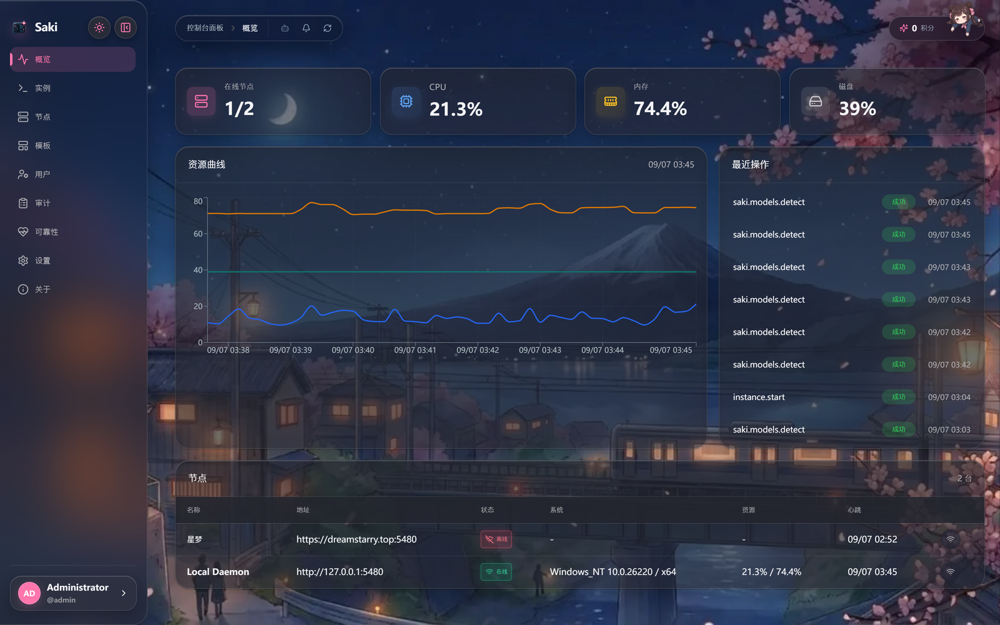
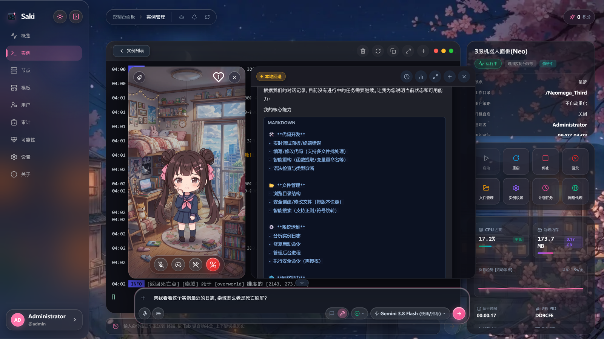
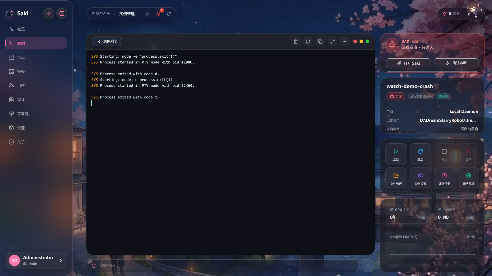

<div align="center">



# Saki Panel

**A server ops panel with an agent that can see, change, and run.**  
High-risk work waits for your OK. Crashes get a fingerprint, a reviewed patch, and a rollback if it happens again.


https://github.com/user-attachments/assets/e404ea96-7a17-4af2-ab1f-d4a45af1caca

<p>
  <a href="https://ethanchan050430.github.io/Saki-Panel/"><b>▶ Play intro</b></a>
  ·
  <a href="https://github.com/EthanChan050430/Saki-Panel/releases/download/intro/Saki_Pannel_intro.mp4">Download 2K</a>
</p>

[](LICENSE)
[](https://github.com/EthanChan050430/Saki-Panel/actions/workflows/check.yml)
[](https://github.com/EthanChan050430/Saki-Panel/releases/latest)
[](https://www.typescriptlang.org/)
[](https://react.dev/)
[](https://fastify.dev/)
[](https://nodejs.org/)
[](https://github.com/EthanChan050430/saki-plugins)

<p>
  <b>English</b> · <a href="README.zh-CN.md">简体中文</a>
</p>

[Why Saki?](#why-saki) · [Saki](#saki) · [Watch](#saki-watch) · [Panel](#panel) · [Plugins](#plugins) · [Quick Start](#quick-start) · [Architecture](#architecture) · [Deploy](#deploy)

</div>

---

Saki Panel is a web console for instances, nodes, files, terminals, and permissions. Saki is not a sidebar chatbot — it reads live status, logs, metrics, and the file tree, then acts inside the same workspace.

You can tell it:

- *Restart the Node service on node-02 and tail the last 50 lines.*
- *`/var` is filling up. Find what's using space and ask before deleting anything.*
- *Update the Minecraft server. Back up the world first.*

Local models via [Ollama](https://ollama.com/) or [LM Studio](https://lmstudio.ai/) work with no API key. Cloud providers and GitHub Copilot are optional.

## Why Saki Panel? (Comparison with Alternatives)

Existing panels (MCSManager, 1Panel, Pterodactyl, aaPanel) are great at what they do — but they're all **passive, manual tools**. When a service crashes at 3 AM, they restart it blindly and leave the log-digging to you.

| What others do | **Saki Panel** |
|:---|:---|
| No AI — you read the logs yourself | **An in-workspace SRE that reads live logs, files and metrics, then acts with scoped tools** |
| Blind restart loops, manual diagnosis | **Saki Watch: fingerprints errors, drafts patches, waits for your OK, auto-rolls back on repeat crashes** |
| Cloud-only AI, configs leave your network | **Zero-config local Ollama & LM Studio — 100% offline, zero API key** |

Pterodactyl is still the standard for commercial multi-tenant game hosting; 1Panel is solid for traditional Linux sites. If you want an AI-native panel with a 24/7 autonomous SRE, **Saki Panel is built for you**.

## Screenshots

**Dashboard** — cluster overview, CPU / memory / disk, resource curves, node health, and recent audit:



**Saki on the logs** — the agent works inside the same workspace: live instance logs behind, Saki chat in front, asked to find out why a player keeps dying:



**Saki Watch incident** — a watched instance exits with code 1, the daemon fingerprints it, and diagnosis waits for your confirm:



---

## Saki

| | |
|:---|:---|
| **Context** | Instance state, stdout/stderr buffers, file trees, CPU / memory / disk. No copy-paste. |
| **Actions** | Start / stop / restart, read and edit files, run commands — scoped to the workspace. |
| **Approvals** | Four risk levels. High-risk needs an explicit confirm. Critical commands are blocked in the daemon. |
| **Skills & MCP** | Recurring runbooks as Skills. External tools over MCP. |
| **Input** | Screenshots, log files, and text attachments in chat. |
| **Guards** | Detects repeated output, stuck tool loops, and runaway turns. XML, Qwen, Hermes, and native JSON tool calls. |

### Local, no cloud

```env
SAKI_PROVIDER=ollama
SAKI_MODEL=llama3.2
SAKI_OLLAMA_URL=http://localhost:11434
```

Or pick OpenAI, Anthropic, DeepSeek, Qwen, Gemini, MiniMax, Zhipu, Moonshot, Doubao, or GitHub Copilot in Settings.

### Saki Watch

When a watched instance exits unexpectedly:

1. **Incident** — Daemon records the exit and groups it by error fingerprint. No model call yet.
2. **Confirm** — You start diagnosis from the incident banner or the notification bell.
3. **Scoped run** — Agent reads logs and files. No shell, no deletes, no startup-command edits.
4. **Review** — Proposed diffs wait for you before anything is written.
5. **Verify** — Service restarts. Same crash again → files roll back to the pre-patch checkpoint.

---

## Panel

- **Dashboard** — Cluster overview, CPU / memory / disk, node health, recent audit.
- **Instances** — Nine types, restart policies, logs, and process probes.
- **Terminal** — xterm.js over WebSocket, reconnects on drop, Minecraft color codes.
- **Files** — Browser, CodeMirror 6 editor, upload / download, zip / tar / rar / 7z in the background.
- **Databases** — SQLite, MySQL / MariaDB, PostgreSQL, Redis. Schema, rows, and queries in the panel.
- **Nodes** — One lightweight daemon per machine. Panel talks to them with node tokens.
- **Tasks** — Cron for commands, restarts, and maintenance, with run history.
- **Access** — RBAC, session timeout, login rate limits, full audit log.
- **Templates** — Reusable start commands, env, and deploy params.

### Instance types

| Type | For |
|:---|:---|
| `generic_command` | Any CLI process |
| `nodejs` | Node apps and package scripts |
| `python` | Scripts and virtualenvs |
| `java_jar` | JARs and Minecraft server jars |
| `shell_script` | Bash / shell |
| `docker_container` | Single containers |
| `docker_compose` | Compose stacks |
| `minecraft` | Dedicated MC servers, console parsing |
| `steam_game_server` | Steam dedicated servers |

---

## Plugins

Every surface can be restyled and extended. Saki Panel ships a **Plugin Workshop** — themes, skins, games, widgets and language packs install in one click, with no rebuild and no restart. A curated collection lives in the [saki-plugins](https://github.com/EthanChan050430/saki-plugins) repository.

<p align="center">
  <a href="https://github.com/EthanChan050430/saki-plugins">
    
  </a>
</p>

| Plugin | Type | What it gives you |
|:---|:---:|:---|
| **简约几何** · `saki-theme-geo` |  | Replaces the liquid-glass UI with a constructivist geometric shell: charcoal sidebar, cobalt accent, chamfered corners. |
| **女仆装** · `saki-skin-maid` |  | Swaps every Saki expression and six-frame loop into a French maid outfit. |
| **切水果** · `saki-game-fruit-slice` |  | An arcade fruit-slicer: swipe flying fruit, dodge bombs, chase combos. |
| **日本語** · `saki-locale-ja` |  | A full Japanese interface pack for the panel. |

Five plugin types are supported — `theme`, `skin`, `game`, `widget` and `locale`. Want to write your own? The [plugin guide](https://github.com/EthanChan050430/saki-plugins#readme) walks you from an empty folder to something the Workshop can see.

---

## Quick Start

**Requires** Node.js ≥ 22.13 and npm ≥ 9.

```bash
git clone https://github.com/EthanChan050430/Saki-Panel.git
cd Saki-Panel
npm install
npx prisma db push --skip-generate
npm run dev
```

Platform scripts under `scripts/` also handle port conflicts:

| OS | Script |
|:---|:---|
| Windows | `scripts/windows/start-dev.ps1` |
| Linux | `bash scripts/linux/start-dev.sh` |
| macOS | `scripts/macos/start-dev.command` |

| Service | URL |
|:---|:---|
| Web | http://localhost:5478 |
| Panel API | http://localhost:5479 |
| Daemon | http://localhost:5480 |

Default login: `admin` / `admin123456`

Change `JWT_SECRET`, `ADMIN_PASSWORD`, and `DAEMON_REGISTRATION_TOKEN` before anything is reachable from the network.

---

## Architecture

```
┌──────────────┐   HTTP / WS + JWT    ┌──────────────┐   HTTP / WS + token   ┌──────────────┐
│     Web      │ ◄──────────────────► │    Panel     │ ◄──────────────────► │    Daemon    │
│  React 19    │                      │  Fastify 5   │                      │  Fastify 5   │
│  Vite 6      │                      │  Saki Agent  │                      │  Node agent  │
│  :5478       │                      │  :5479       │                      │  :5480       │
└──────────────┘                      └──────────────┘                      └──────┬───────┘
                                                                                   │ spawn
                                                                                   ▼
                                                                            ┌──────────────┐
                                                                            │  Instances   │
                                                                            └──────────────┘
```

| Layer | Role |
|:---|:---|
| **Web** | Console and Saki chat. React 19, Vite 6, CodeMirror 6, xterm.js. |
| **Panel** | Auth, database, RBAC, audit, Saki. Fastify 5, Prisma 6, SQLite. |
| **Daemon** | Process, files, terminal, metrics on each machine. |
| **Shared** | Types and contracts. |

```text
apps/web        frontend
apps/panel      API + Saki
apps/daemon     node agent
packages/shared types
prisma/         SQLite schema
```

---

## Deploy

### Docker Compose

```bash
export JWT_SECRET="your-secure-random-secret"
export ADMIN_PASSWORD="your-strong-admin-password"
export DAEMON_REGISTRATION_TOKEN="your-daemon-token"

docker compose build
docker compose up -d
```

Split public hosts:

```bash
export PANEL_PUBLIC_URL="http://your-server-ip:5479"
export WEB_ORIGIN="http://your-server-ip:5478"
export PANEL_CORS_ORIGINS="*"
export VITE_API_BASE_URL="http://your-server-ip:5479"

docker compose build --no-cache panel web
docker compose up -d
```

### systemd

```bash
sudo cp scripts/linux/saki-panel.service /etc/systemd/system/
sudo cp scripts/linux/saki-panel-daemon.service /etc/systemd/system/
sudo systemctl daemon-reload
sudo systemctl enable --now saki-panel
sudo systemctl enable --now saki-panel-daemon
```

---

## Commands

```bash
npm run dev          # panel + daemon + web
npm run dev:panel
npm run dev:daemon
npm run dev:web
npm run build
npm run check        # typecheck all workspaces
npm run db:push
```

---

## License

Apache License 2.0. See [LICENSE](LICENSE).

```
Copyright 2024-2026 DreamStarryRobot Contributors
```
