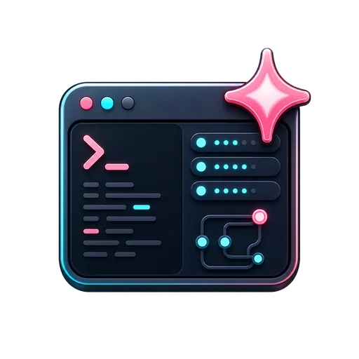
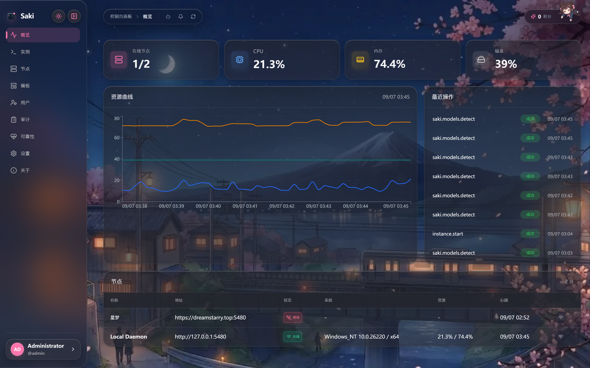
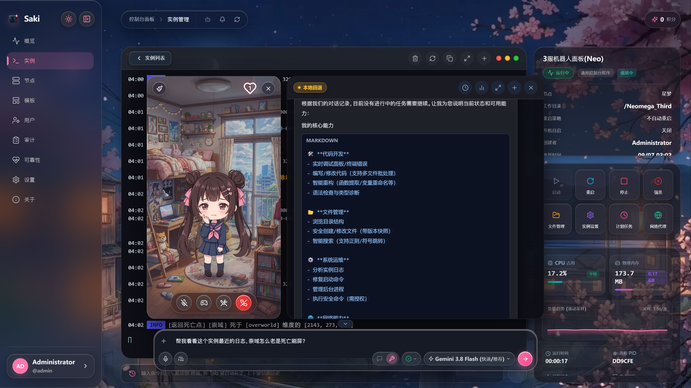
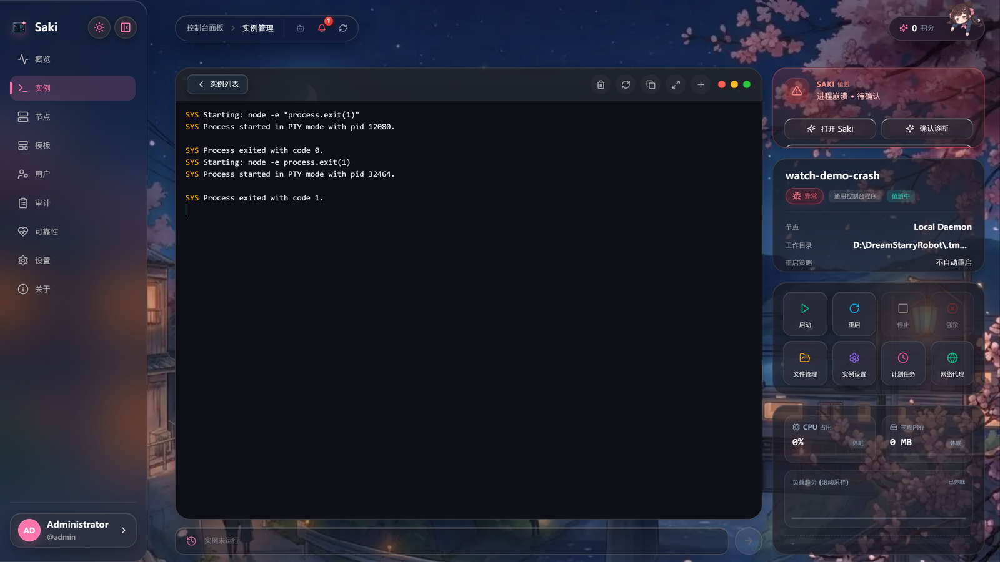

# Saki Panel

**An open-source server operations panel with AI in the workspace.**

Manage Minecraft, Steam, Docker, and ordinary processes from one web console. Saki uses live logs, files, and node metrics to help investigate incidents and can act after authorization.

[Screenshots](#screenshots) · [Quick start](#quick-start) · [Download a release](https://github.com/EthanChan050430/Saki-Panel/releases/latest) · [简体中文](README.zh-CN.md)

https://github.com/user-attachments/assets/99a8d410-c079-4368-86c9-f847413d4580

## Screenshots

Saki Panel brings instances, nodes, terminals, files, databases, and access control into one workspace. When something fails, Saki can inspect the current instance's status and logs and propose actions without making you copy context between a panel, a terminal, and a separate chat.

## What you can do

| Area | Capabilities |
|:---|:---|
| **AI-assisted operations** | Ask about status and logs, inspect or edit workspace files, manage instances, and run scoped commands. Supports Skills, MCP, and image or log attachments. |
| **Saki Watch** | Record unexpected exits and error fingerprints, diagnose incidents, review patches, and roll back a change when verification fails under supported conditions. |
| **Instances and nodes** | Manage nine instance types across Daemon nodes, including Minecraft, Steam, Docker containers, and Compose stacks. |
| **Daily administration** | Web terminal, file editing and transfers, SQLite / MySQL / PostgreSQL / Redis, scheduled tasks, and instance templates. |
| **Visibility and access** | Cluster dashboard, reliability reports, audit history, and role-based access. Send incident notifications through webhooks, DingTalk, WeCom, or Telegram. |
| **Extensions** | Install themes, Saki skins, games, widgets, and locales. Import optional operations packs with templates and runbooks. |

Saki can use local Ollama or LM Studio models, or a cloud provider configured in Settings. Local inference keeps model requests on your chosen local endpoint; cloud models, online plugins, and operations packs use external services when selected.

## Quick start

### Run locally from source

Requires Node.js ≥ 22.13 and npm ≥ 9.

~~~bash
git clone https://github.com/EthanChan050430/Saki-Panel.git
cd Saki-Panel
npm install
npm run db:push
npm run dev
~~~

Open [http://localhost:5478](http://localhost:5478). The Panel API defaults to port `5479` and the local Daemon to `5480`. The development login is `admin` / `admin123456`. Change the default password and secrets before making the services reachable from other devices.

Development start scripts are available at `scripts/windows/start-dev.ps1`, `scripts/linux/start-dev.sh`, and `scripts/macos/start-dev.command`. You can also choose a compatible package from [Releases](https://github.com/EthanChan050430/Saki-Panel/releases/latest), when one is available for your system.

### Use prebuilt Docker images

Download [docker-compose.ghcr.yml](docker-compose.ghcr.yml) into your deployment directory and create a `.env` file:

~~~dotenv
JWT_SECRET=replace-with-a-long-random-secret
ADMIN_PASSWORD=replace-with-a-strong-password
DAEMON_REGISTRATION_TOKEN=replace-with-a-separate-random-token
~~~

~~~bash
docker compose -f docker-compose.ghcr.yml pull
docker compose -f docker-compose.ghcr.yml up -d
~~~

The default web address is `http://localhost:5478`. For remote or public deployments, set `WEB_ORIGIN`, `PANEL_PUBLIC_URL`, and `PANEL_CORS_ORIGINS` to your actual origins, configure HTTPS for Web, Panel, and remote Daemons, and limit exposed ports. Node tokens authenticate requests; the default HTTP transport does not encrypt them. The Compose file mounts the Docker socket into the Daemon, so review the permissions granted to that node.

To build the images from source instead, use [docker-compose.yml](docker-compose.yml), supply the same secrets in `.env`, and run `docker compose up -d --build`. See [.env.example](.env.example) for more options.

## How Saki helps investigate

Saki combines the current instance's state, logs, files, and resource metrics with scoped tools for instance and file operations. Actions have risk levels; operations requiring approval are shown before execution, and the Daemon blocks certain dangerous commands. Results depend on the selected model, granted permissions, and node environment.

For example, ask it to inspect logs before a crash and identify a likely configuration error, or to restart a service and watch its new logs. You can attach screenshots and log files. Save recurring procedures as Skills or connect external tools through MCP.

## How Saki Watch responds to incidents

1. After an unexpected exit, the Daemon records exit details and an error fingerprint. By default, no model call happens yet.
2. A user starts AI diagnosis from the incident notification. An administrator can optionally enable automatic diagnosis for an instance.
3. Diagnosis reads logs and files. Proposed edits are shown as diffs and require human approval by default.
4. An optional auto-approval policy applies only to small patches that meet risk, confidence, scope, and instance-state limits.
5. After a patch, Watch restarts and verifies the instance. If verification finds the same failure or a configured health check fails, and a usable checkpoint and acting user exist, it attempts to roll back that change. Other outcomes are recorded for manual follow-up.

Watch also supports cooldowns, run limits, notification channels, and escalation reminders. Configure these in instance and system settings.

## Panel and extensions

Instance types: `generic_command`, `nodejs`, `python`, `java_jar`, `shell_script`, `docker_container`, `docker_compose`, `minecraft`, and `steam_game_server`. The instance view provides lifecycle controls, logs, process probes, and optional proxy settings. Templates reuse launch commands and environment variables.

The file manager supports browsing, editing, transfers, and common archives. The database workspace supports SQLite, MySQL / MariaDB, PostgreSQL, and Redis. Scheduled tasks keep run history; users, roles, and audit logs help manage access and trace actions.

The Plugin Workshop supports [themes, skins, games, widgets, and locales](https://github.com/EthanChan050430/saki-plugins). The Templates page also offers optional **Minecraft Paper** and **Docker Compose Service Guardian** operations packs. Downloads verify hashes and sizes; importing templates or runbooks is a separate action, and downloading alone does not execute scripts or change instances. See the [operations pack documentation](operations-packs/README.md).

## Architecture and development

~~~text
Web (React / Vite)  ──HTTP / WebSocket──  Panel (Fastify / Prisma)
                                               │
                                          HTTP / WebSocket
                                               │
                                      Daemon (one per node)
                                               │
                                        Service instances
~~~

`apps/web` is the web console, `apps/panel` provides the API, authentication, audit, and Saki, `apps/daemon` manages processes and files on each node, `packages/shared` holds shared contracts, and `prisma` contains the database schema.

~~~bash
npm run dev                 # Start Panel, Daemon, and Web
npm run build               # Build all workspaces
npm run check               # TypeScript checks
npm run db:push             # Sync the SQLite schema
npm run verify:operation-packs
~~~

See [CONTRIBUTING.md](CONTRIBUTING.md) to contribute and [SECURITY.md](SECURITY.md) to report a vulnerability.

## License

Apache License 2.0. See [LICENSE](LICENSE).
